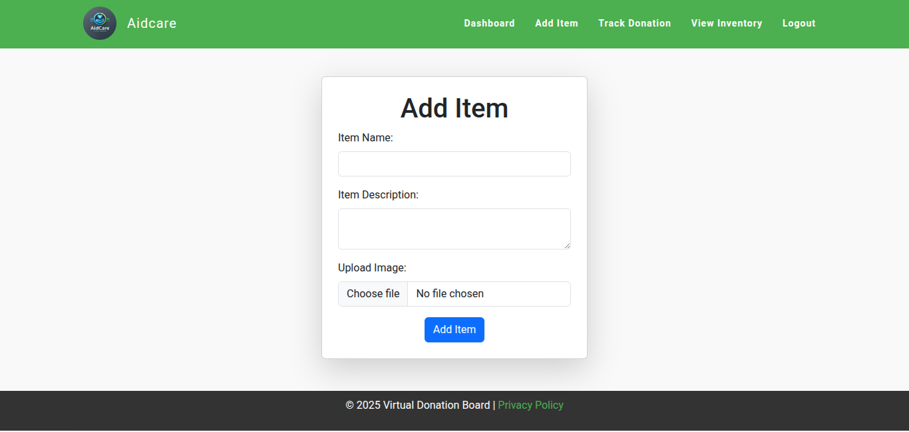
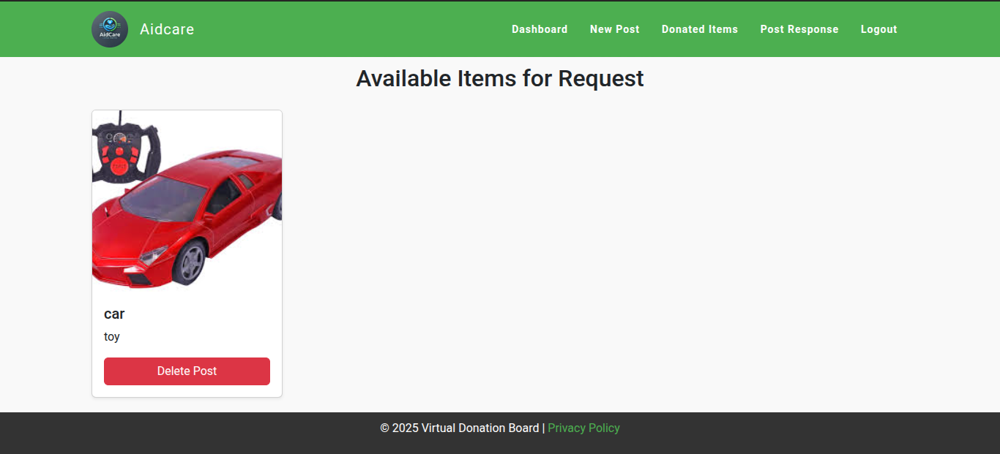
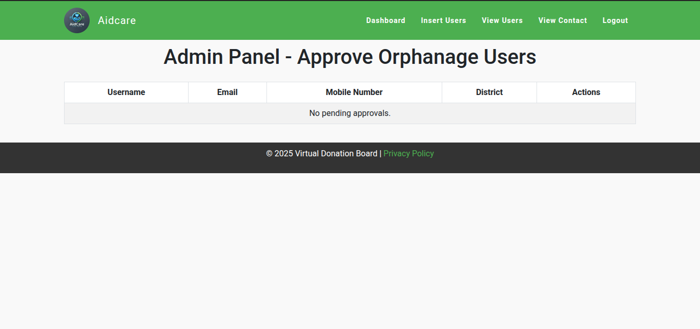

#  AidCare — Orphanage Donation Management System

AidCare is a full-stack **web application** that bridges donors and orphanages by enabling **item-based donations** within local communities. Donors can register and maintain an inventory of items to donate, while orphanages post requests for needed supplies. The platform enforces:

- 🔐 **Role-based navigation** (Donor, Orphanage, Admin)  
- 📍 **District-based filtering** (only relevant requests)  
- ⚙️ **Secure authentication & verification**  

> 🚀 **Live Demo (Frontend Only):** [https://aidcare.vercel.app](https://aidcare.vercel.app)  
> 🧪 Full functionality (admin approvals, orphanage verification, donation flows) requires **local setup**.

---

## 🧩 Problem Statement

In many areas, orphanages struggle to obtain essentials. Traditional donation systems:

- ⏱️ Require physical visits by representatives (inefficient)  
- 📦 Receive unwanted or excess items  
- 🤝 Lack trust and transparency between donors & recipients  
- 🧾 Have no structured system to track needs and donations  

---

## 💡 Why AidCare?

AidCare solves these issues by:

- 🗺️ Creating a **district-local donation board**  
- 📝 Allowing donors to add inventory items (clothes, books, tools)  
- 📬 Letting orphanages post specific **item-based requests**  
- ✅ Enabling only **verified orphanages** to access donation requests  
- 📊 Ensuring donation **matches real needs**, reducing waste  
- 🔒 Enhancing trust via manual verification & secure authentication  

---

## ✨ Key Features

- 🧑‍🤝‍🧑 **Role-Based Dashboards:** Separate interfaces for Donors, Orphanages, and Admin.  
- 🌍 **Local (District) Matching:** Donors only see orphanage requests from their own district.  
- 📦 **Inventory Management:** Donor users can add, edit, and track items they wish to donate.  
- 📌 **Post-Based Requests:** Orphanages create and manage item requests, visible only to matching donors.  
- 🔐 **Secure Authentication:** Hashed passwords (bcrypt), email verification, CSRF protection, and session management.  
- 📬 **Admin Approval:** Admins manually verify orphanage registrations to prevent fraud.  

---

## 🧰 Tech Stack

<p align="center">
  &nbsp;
  &nbsp;
  &nbsp;
  &nbsp;
  <br><br>
  &nbsp;
  &nbsp;
  &nbsp;
  &nbsp;
    
</p>

---

## ⚙️ Installation & Local Setup

Follow these steps to run the full-stack project on your local machine:

### 🔧 Prerequisites

- **Python 3.7+**  
- **MySQL Server & Workbench**  
- **Visual Studio Code** (or any code editor)

### 📥 Clone the Repository

```bash
git clone https://github.com/jeeva64/Aidcare.git
cd Aidcare
````

### 🐍 Create & Activate a Virtual Environment

```bash
python -m venv venv
# Windows:
.\venv\Scripts\activate
# macOS/Linux:
source venv/bin/activate
```

### 📦 Install Dependencies

```bash
pip install -r requirements.txt
```

### 🛠️ Configure MySQL

1. Open MySQL Workbench and create a new database:

   ```sql
   CREATE DATABASE aidcare_db;
   ```

2. Update `settings.py` in the Django project:

   ```python
   DATABASES = {
       'default': {
           'ENGINE': 'django.db.backends.mysql',
           'NAME': 'aidcare_db',
           'USER': 'root',
           'PASSWORD': 'your_password',
           'HOST': 'localhost',
           'PORT': '3306',
       }
   }
   ```

### 🔃 Apply Migrations

```bash
python manage.py makemigrations
python manage.py migrate
```

### 🚀 Run the Development Server

```bash
python manage.py runserver
```

Visit [http://127.0.0.1:8000](http://127.0.0.1:8000) in your browser.

> ⚠️ **Note:** The hosted version shows only the frontend UI. To explore full backend features (admin approval, request flows), run locally.

---

## 🖼️ Screenshots


### 🧑‍💼 Donor Dashboard



### 🏠 Orphanage Dashboard



### 🧑‍💻 Admin Dashboard




## 🔐 License

This project is licensed under a **custom Personal Use Only License**.

* ✅ **Allowed:** Viewing, studying, interview preparation
* ❌ **Not Allowed:** Commercial hosting, academic project submission, rebranding

See full [LICENSE](LICENSE) file for detailed terms.


## 📬 Contact

Developed by **Jeeva Loganathan**
📧 Email: [jeevajeevaloganathan977@gmail.com](mailto:jeevajeevaloganathan977@gmail.com)
🔗 GitHub: [github.com/jeeva64](https://github.com/jeeva64)
🌐 Project Repo: [AidCare GitHub](https://github.com/jeeva64/Aidcare/)


> 🙏 Thank you for exploring AidCare!
> If you’re a recruiter or interviewer, feel free to explore the live frontend via the link above and review the code locally for full-stack features.

`
